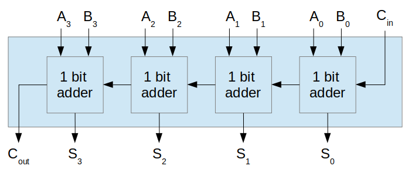
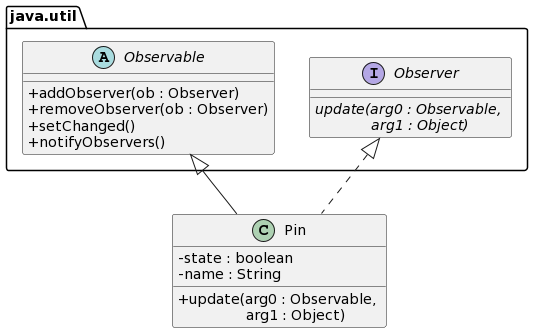

CAD of circuits
===

- a complete design and implementation example 
- with composite and observer 
- with [Python implementation](https://github.com/mat-cad/cad_circuits)


---

Goal
===

Design and implement an application to

- design logic circuits 
- based on logic gates AND, OR, NOT (for the moment) as building atoms
- once designed, one can simulate = compute output for a certain input

Learning goals:
- example of two patterns combined
- show code implementing the design
- illustrate the process: cycle of a little design, a little code, a little testing...


---


https://ei.jhu.edu/logic-circuit-simulator/

---


https://academo.org/demos/logic-gate-simulator/

---


https://sciencedemos.org.uk/logic_gates.php

---

**Key difference** : we want to allow **grouping of gates and / or groups** to make a new element by copy-paste as if it was a simple gate.


---

Why ? To make complex circuits by making groups = hierarchy of abstractions, and copy-pasting them :

     

---

However, **no graphical user interface** for the moment. We will replace user interactions by client code. 

The user interaction is *hardcoded* in the programming sentences.


For instance, making a unique And gate and simulating it is like:

---

```python
and1 = And("my and") # two inputs, one output
input1 = True
input2 = False
and1.set_input(0, input1)
and1.set_input(1, input2)
and1.process()
print('{} : {} and {} = {}'.format(and1.name, input1, input2, and1.output))
```

---

For simplicity, we **won’t allow loops** as in a flip-flop :


And also, the **order of creation** of the gates is the right one for the simulation (see later)

---

How to begin
===

1. detailed design to support instantiation of gates
1. and grouping gates and/or groups
1. to check it's right, write the code to create an xor from basic gates
1. test creation of an and, or, not
1. simulation = check that for all possible inputs the output is the one we expect
    - of each individual gate
    - of several gates making an xor

Design $\rightarrow$ program $\rightarrow$ test $\rightarrow$ more design $\rightarrow \ldots$

---

First design
===


- any circuit has a name and you can process = simulate it
- ands, ors have one output and 2 (default) or more inputs
- a group as one or more inputs and outputs
- a group has one or more circuits inside

---

How's the code to make an xor ? 


---

```python
xor = Component("xor", 2, 1)
or1 = Or("or1")
and1 = And("and1")
not1 = Not("not1")
and2 = And("and2")
# the order of adds will matter to simulation
xor.add_circuit(or1) # more readable than xor.circuits.append(or)
xor.add_circuit(and1)
xor.add_circuit(not1)
xor.add_circuit(and2)
```

---

```python
from abc import ABC

class Circuit(ABC):
    def __init__(self, name):
        self.name = name

    def process(self):
        raise NotImplementedError
        # can not call process(), it's an abstract method

class And(Circuit):
    def __init__(self, name, num_inputs=2):
        super().__init__(name)
        self.inputs = [None]*num_inputs
        self.output = None

    def process(self):
        pass # TODO
```

---

```python
class Component(Circuit):
    def __init__(self, name, num_inputs, num_outputs):
        super().__init__(name)
        self.inputs = [None] * num_inputs
        self.output = [None] * num_outputs
        self.circuits = []

    def add_circuit(self, circuit):
        self.circuits.append(circuit)

    def process(self):
        pass # TODO        
```

---

Gates and also components, i.e circuits, have **input and output pins**. 


A pin has an **state**, ``true`` or ``false``.

---

<font style="color:green;"><b>Connections</b></font> are wires that connect two <font style="color:red;"><b>pins</b></font> in order to **pass logical state** during circuit simulation. 

Are all combinations of pin connections Input-Input, Input-Output, O-I, O-O possible connections?


---

A circuit has 1 or more inputs. But a **unique output ?** No, a 1 bit full adder has 
- 3 inputs : bit1, bit2, carry in
- 2 outputs: sum bit and carry out

 

---

Since circuits have one or more input and output pins...


---

``PinInput`` and ``PinOutput`` are the same, pins, the only difference is their role wrt. the circuit $\rightarrow$ redundancy.


- who makes the pins of a circuit? and how many?
- who makes the connections? 
- how and when do they pass state from one pin to another?

---

```python
from abc import ABC

class Pin():
    def __init__(self, name):
        self.name = name
        self.state = None

class Circuit(ABC):
    def __init__(self, name, num_inputs, num_outputs):
        self.name = name
        self.inputs = [Pin('input {} of {}'.format(i + 1, name)) 
                       for i in range(num_inputs)]
        self.outputs = [Pin('output {} of {}'.format(i + 1, name)) 
                        for i in range(num_outputs)]

    def process(self):
        raise NotImplementedError
        # can not call process(), it's an abstract method
```

---

```python
class And(Circuit):
    def __init__(self, name, num_inputs=2):
        super().__init__(name, num_inputs, 1)

    def process(self):
        # TODO: not evident when we have multiple gates and components
        #  in a circuit because we have to the propagate output
        pass

class Component(Circuit):
    def __init__(self, name, num_inputs, num_outputs):
        super().__init__(name, num_inputs, num_outputs)
        self.circuits = []

    def add_circuit(self, circuit):
        self.circuits.append(circuit)

    def process(self):
        # TODO
        pass
```

---

Back to creation of an xor :


```python
xor = Component('xor', 2, 1)
or1 = Or('or1')
and1 = And('and1')
not1 = Not('not1')
and2 = And('and2')
xor.add_circuit(or1) # more readable than xor.circuits.append(or)
xor.add_circuit(and1)
xor.add_circuit(not1)
xor.add_circuit(and2)
```

---

Now logical gates and components (groups) have pins.

But **we are not yet connecting** the pins of the and1, and2, or, not and xor objects.

---

Which are the connections to make an xor
?


---

What’s the purpose of connecting input and output pins? What should a connection object do?

- pass (copy) the state of the origin pin to the destination pin *or pins* connected to it
- do it every time the state of the origin pin has changed
- therefore, each time ``setState(aState)`` of the origin pin is invoked

How to implement this behavior?

---



- make ``Pin`` both observable and observer

- a ``Pin`` object may observe another ``Pin`` object. When the later changes, the former updates itself accordingly =
copies the state of the observed pin

- a pin may have several pin observers (eg. input 1 to xor goes to and1 and or)

- we are not avoiding any class dependency but reusing an already implemented behaviour


---

Python (no ``Observable``, ``Observer``)
```python
class Observable(ABC):
    def __init__(self):
        self.observers = []

    def add_observer(self, observer):
        self.observers.append(observer)

    def remove_observer(self, observer):
        pass # TODO

    def notify_observers(self, an_object=None):
        for obs in self.observers:
            obs.update(self, an_object)
            # observable sends itself to each observer

class Observer(ABC):
    def update(self, observable, an_object):
        raise NotImplementedError
        # abstract method
```

---

```python
class Pin(Observable, Observer):
    def __init__(self, name):
        super().__init__()
        self.name = name
        self.state = None

    def is_state(self):
        return self.state

    def set_state(self, new_state):
        self.state = new_state
        self.notify_observers(self)

    def update(self, observed_pin, an_object):
        self.set_state(observed_pin.is_state())
```

---

Again, what should a connection object do?

Connect two pins = make one observe the other from that moment on.


```python
class Connection:
    def __init__(self, pin_from, pin_to):
        pin_from.add_observer(pin_to)
``` 

This is the whole Connection class. A connection doesn't keep reference to its pins.

Simple because we are not yet implementing disconnections nor copy-paste of a group, which requires copying also connections.

---

```python
xor = Component('xor', 2, 1)
or1 = Or('or1')
and1 = And('and1')
not1 = Not('not1')
and2 = And('and2')
# the order of adds will matter to simulation
xor.add_circuit(or1) 
xor.add_circuit(and1)
xor.add_circuit(not1)
xor.add_circuit(and2)
# the order will matter to simulation
Connection(xor.inputs[0], and1.inputs[0])
Connection(xor.inputs[0], or1.inputs[0])
Connection(xor.inputs[1], and1.inputs[1])
Connection(xor.inputs[1], or1.inputs[1])
Connection(or1.outputs[0], and2.inputs[0])
Connection(and1.outputs[0], not1.inputs[0])
Connection(not1.outputs[0], and2.inputs[1])
Connection(and2.outputs[0], xor.outputs[0])
```

---

### What is in ``process()`` ?

```python
class Not(Circuit):
    def __init__(self, name):
        super().__init__(name, 1, 1)

    def process(self):
        self.outputs[0].set_state(not self.inputs[0].is_state())

class And(Circuit):
    def __init__(self, name, num_inputs=2):
        super().__init__(name, num_inputs, 1)

    def process(self):
        result = True
        for pin_input in self.inputs:
            result = result and pin_input.is_state()
        self.outputs[0].set_state(result)
```

---

```python
class Component(Circuit):
    def __init__(self, name, num_inputs, num_outputs):
        super().__init__(name, num_inputs, num_outputs)
        self.circuits = []

    def add_circuit(self, circuit):
        self.circuits.append(circuit)

    def process(self):
        for circuit in self.circuits:
            circuit.process()
```

---

## complete first<br>design


---

Test: does it work?
===

```python
print('\nTest of And')
inputs = [[False, False], [False, True], [True, False], [True, True]]
expected_outputs = [False, False, False, True]

for (input1, input2), expected_output in zip(inputs, expected_outputs):
    and1.set_input(0, input1)
    and1.set_input(1, input2)
    and1.process()
    output = and1.outputs[0].is_state()
    print('{} AND {} = {}'.format(input1, input2, output))
    assert output == expected_output

print('\nTest of xor')
expected_outputs = [False, True, True, False]
for (input1, input2), expected_output in zip(inputs, expected_outputs):
    xor.set_input(0, input1)
    xor.set_input(1, input2)
    xor.process()
    output = xor.outputs[0].is_state()
    print('{} XOR {} = {}'.format(input1, input2, output))
    assert output == expected_output
```

---

```text
Test of And
False AND False = False
False AND True = False
True AND False = False
True AND True = True

Test of xor
False XOR False = False
False XOR True = True
True XOR False = True
True XOR True = False
```

---

Second design, Python version
===

We have not yet implemented the functionality of "copy-paste" of gates and components.

Let's make a **one bit full adder** $\rightarrow$ copy-paste of an xor.

 

---

We want to be able to write the hardcoded version of user interface copy-paste.

```python
xor1 = Component('xor1', 2, 1)
or1 = Or('or1')
and1 = And('and1')
not1 = Not('not1')
and2 = And('and2')

xor1.add_circuit(or1) 
xor1.add_circuit(and1)
xor1.add_circuit(not1)
xor1.add_circuit(and2)

Connection(xor1.inputs[0], and1.inputs[0])
Connection(xor1.inputs[0], or1.inputs[0])
Connection(xor1.inputs[1], and1.inputs[1])
Connection(xor1.inputs[1], or1.inputs[1])
Connection(or1.outputs[0], and2.inputs[0])
Connection(and1.outputs[0], not1.inputs[0])
Connection(not1.outputs[0], and2.inputs[1])
Connection(and2.outputs[0], xor1.outputs[0])
```


---

Making now the one bit full adder is easy thanks to Python's  ``deepcopy``, read [Shallow vs Deep Copying](https://realpython.com/copying-python-objects/)

```python
import copy # has deepcopy

oneBitAdder = Component("OneBitAdder", 3, 2)
xor2 = copy.deepcopy(xor1)
xor2.name = 'xor2'
and3 = And('and3')
and4 = And('and4') # or copy.deepcopy(and3) and rename
or2 = Or('or2');
# this order matters for the simulation
oneBitAdder.add_circuit(xor1)
oneBitAdder.add_circuit(xor2)
oneBitAdder.add_circuit(and3)
oneBitAdder.add_circuit(and4)
oneBitAdder.add_circuit(or2)
```


---

Get a reference to the pins of each gate/component
```python
A = oneBitAdder.inputs[0]
B = oneBitAdder.inputs[1]
Ci = oneBitAdder.inputs[2]
S = oneBitAdder.outputs[0]
Co = oneBitAdder.inputs[1]

input1Xor1 = xor1.inputs[0]
input2Xor1 = xor1.inputs[1]
outputXor1 = xor1.outputs[0]

input1Xor2 = xor2.inputs[0]
...
outputAnd4 = and4.outputs[0]

input1Or2 = or2.inputs[0]
input2Or2 = or2.inputs[1]
outputOr2 = or2.outputs[0]
```


---

Make the connections
```python
Connection(A, input1Xor1)
Connection(B, input2Xor1)
Connection(outputXor1, input1Xor2)
Connection(Ci, input2Xor2)
Connection(outputXor1, input1And3)
Connection(Ci, input2And3)
Connection(A, input1And4)
Connection(B, input2And4)
Connection(outputAnd3, input1Or2)
Connection(outputAnd4, input2Or2)
Connection(outputXor2, S)
Connection(outputOr2, Co)
```


---

## Test

```python
# make all possible inputs (A, B, Ci) to 1-bit full adder
inputs = []
for a in [False, True]:
    for b in [False, True]:
        for c in [False, True]:
            inputs.append([a,b,c])

# the expected result (S, Co) for each input
expected_S = [False, True, True, False, True, False, False, True]
expected_Co = [False, False, False, True, False, True, True, True]

for (a, b, ci), exp_s, exp_co in zip(inputs, expected_S, expected_Co):
  A.set_state(a)
  B.set_state(b)
  Ci.set_state(ci)
  oneBitAdder.process()
  s = S.is_state()
  co = Co.is_state()
  print('{} + {} + {} = {}, {}'.format(a, b, ci, s, co))
  assert s == exp_s
  assert co == exp_co
```

---

$\tt{A} + \tt{B} + \tt{C_i} = \tt{S}, \tt{C_o}$

```text
False + False + False = False, False
False + False + True = True, False
False + True + False = True, False
False + True + True = False, True
True + False + False = True, False
True + False + True = False, True
True + True + False = False, True
True + True + True = True, True
```

---

We could continue with a 4-bits adder 
 

```python
one_bit_adder_1 = deepcopy(oneBitAdder)
one_bit_adder_2 = deepcopy(oneBitAdder)
one_bit_adder_3 = deepcopy(oneBitAdder)
one_bit_adder_4 = deepcopy(oneBitAdder)
four_bits_adder = Component("4bitsAdder", 9, 5) # 4As + 4Bs + 1Cin, 4S + 1Cout
# make the connections between four_bits_adder inputs and
# input of each one bit adder
...
# make the connnections between Cout -> Cin of 3 one bit adders
...
# make the connections between outputs of one bit adders and 
# outputs of the four bits adder
...
```

---

And now an **eight bits full adder**...


<span style="color:green;">

Homework: 
- extend the Python code to make the 4-bits and the 8-bits full adders
- write the corresponding tests
</span>

---

Summary
===

- example of composite + observer
- development = cycles of design, program, test
- improvements / continuation:
    - order of circuits in a component matters, and also order of connections = propagation of states, maybe a [topological graph sorting](https://en.wikipedia.org/wiki/Topological_sorting) could solve this
    - how to remove a connection between two given pins?   
        - disconnect is not just delete the connection object, the ``toPin`` should stop observing the ``fromPin`` $\rightarrow$ a ``Connection`` should keep a reference to its two pins
        - keep a list of all the connections made